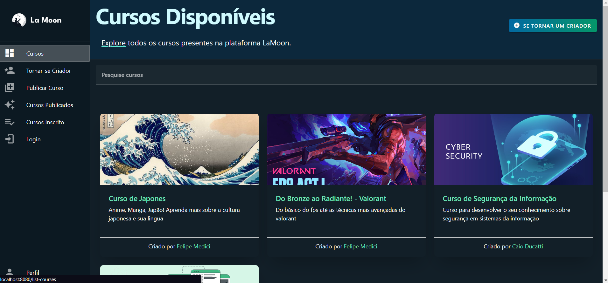
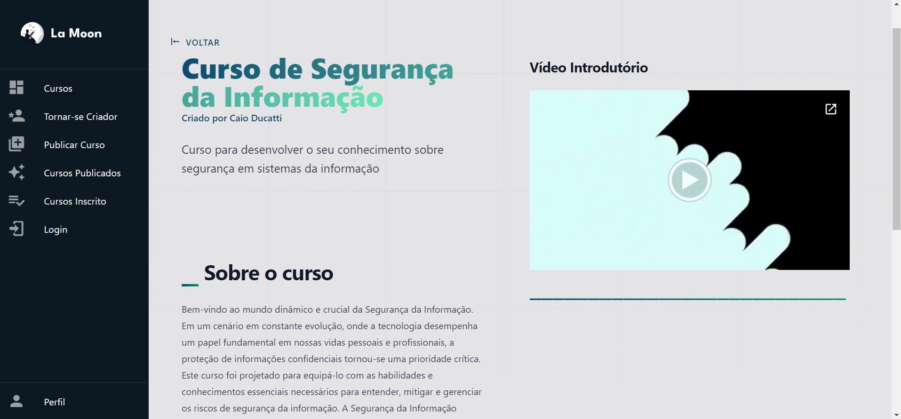
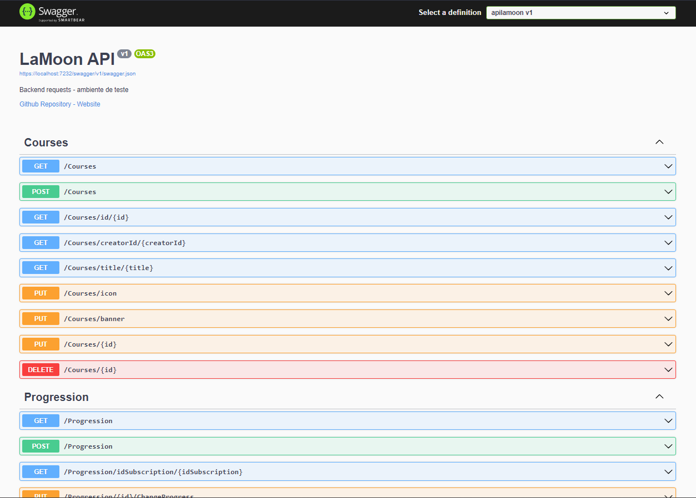

# API - LaMoon
> Aplicação desenvolvida para a matéria de Projeto Integrador - BCC 2023

English Readme:
[README](README.md)

## Descrição
Uma api de cursos online, onde um usuário pode desde se inscrever em um curso, progredir, concluir cursos, até se tornar um criador e publicar cursos que quiser.

> Courses List Page:


> Main Course Page:


## Funcionalidades

- Sessão de login com tipos de usuário (Normal,Criador,Administrador)
- Requisições de progressão de curso automatizada
- Aprovação de criador com requisição integrada ao front
- Customização de curso na publicação e alteração

## Documentação e Estrutura
Documentação de requisições, estruturação json e integração, estão presentes respectivamente em *README_Back.md* e *README_Front.md* 

A aplicação está estrutura em front-end e back-end, sendo as duas aplicações presentes nesse repositório.

A pasta *'\apilamoon'* representa o back-end, desenvolvido em C#, dotNet 6.0 e NoSQL(MongoDB);

A pasta *'\weblamoon'* representa o front-end, desenvolvido em vue.js, javascript, tailwind ;

> Utilização do swagger para ambiente de teste de requisições e estrutura de objetos:


## Linguagens e Tecnologias
**Back-end:** 
[](https://skillicons.dev)

**Front-end:** 
[](https://skillicons.dev)

## Rodando localmente

Clone o projeto

```bash
  git clone https://github.com/femedici/api-plataforma_cursos.git
```

Entre no diretório 'apilamoon' - back do projeto

```bash
  cd /apilamoon
```

Inicie o servidor

```bash
  dotnet run
```

Entre no diretório 'weblamoon' - front do projeto

```bash
  cd /weblamoon
```

Instale as dependências

```bash
  npm i
```
Inicie o servidor

```bash
  npm run serve
```

Acesse a porta de navegador: http://localhost:8080/

## Autor

- [@femedici](https://github.com/femedici) 

### Contribuidores

- [@femattok](https://github.com/mattokgit44)
- [@femoran](https://github.com/feliperm17)
- [@caioducati](https://github.com/Cast43) 
